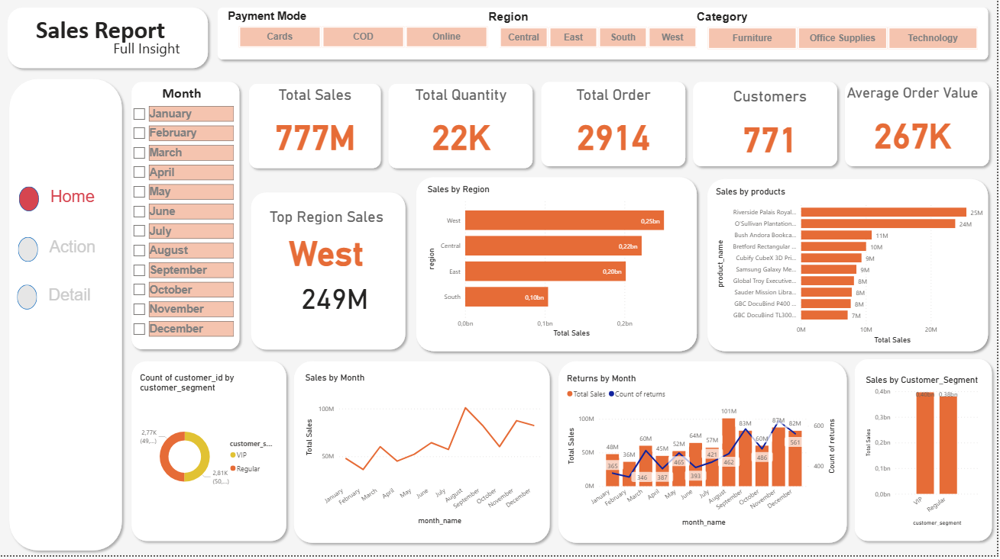
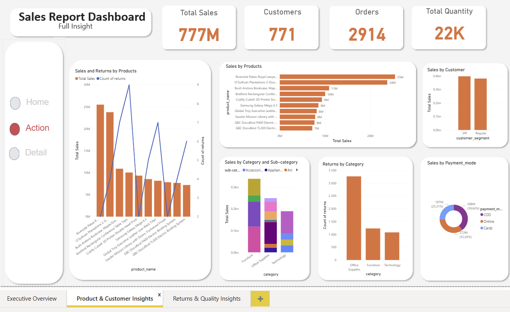

# 📊 Sales & Returns Analysis Dashboard

## 📌 Project Overview
This project analyzes sales performance, customer behavior, and product quality
using **Python (Pandas, Matplotlib)** and **Power BI**.

The goal is to provide business insights on:
- Sales trends over time
- Customer segment behavior (VIP vs Regular)
- Product performance
- Returns and quality issues

---

## 🛠 Tools & Technologies
- Python (Pandas, NumPy, Matplotlib)
- Jupyter Notebook
- Power BI
- GitHub

---

## 🔄 Project Workflow
1. Data Cleaning & Preparation (Python)
2. Feature Engineering (Year, Month, Segments)
3. Exploratory Data Analysis (EDA)
4. Interactive Dashboard Development (Power BI)

---

## 📈 Dashboard Pages

### 1️⃣ Executive Overview
- Total Sales
- Total Quantity
- Total Orders
- Distinct Customers
- Monthly Sales Trend
- Sales by Region & Category

---

### 2️⃣ Product & Customer Insights
- Top Products by Sales
- Sales & Quantity by Customer Segment
- Sales vs Returns by Product
- Category & Sub-category Performance

---

### 3️⃣ Returns & Quality Insights
- Top Returned Products
- Return Rate by Category
- Monthly Sales vs Returns Trend

---

## 🔍 Key Insights
- High sales do not always mean high quality (returns matter)
- VIP customers generate higher revenue but not always higher volume
- Technology category shows higher return rate
- Returns increase during high sales months

---

## 📁 Data Source
Sales transactional dataset (cleaned and processed using Python).

---

## 🚀 How to Use
1. Clone the repository
2. Open notebooks for analysis
3. Open Power BI file to explore the dashboard

---

## 👩‍💻 Author
Fatima Zahra ER RAMI 
Data Analyst | Python | Power BI
